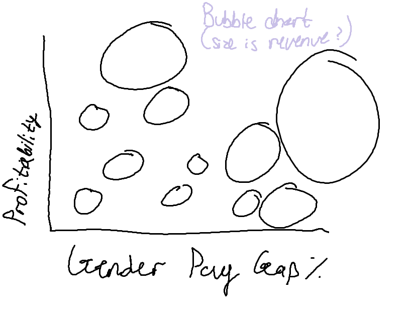
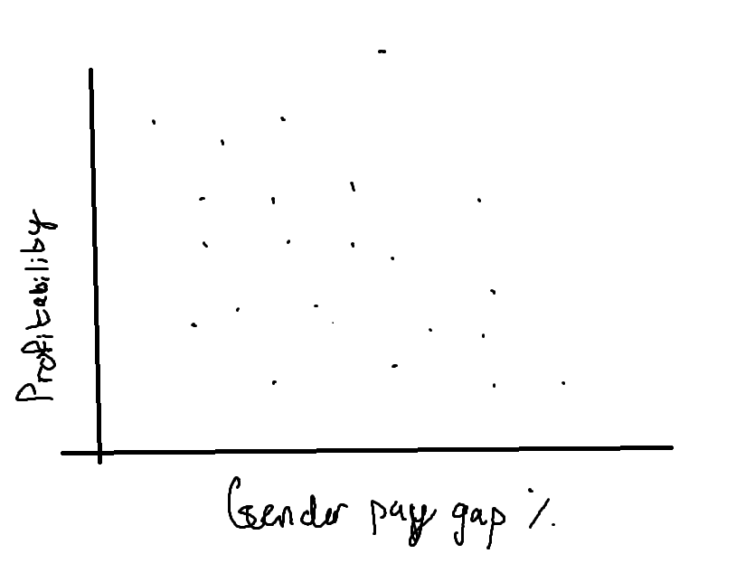
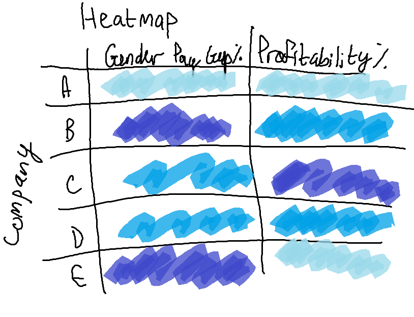

| [home page](https://cmustudent.github.io/tswd-portfolio-templates/) | [data viz examples](dataviz-examples) | [critique by design](critique-by-design) | [final project I](final-project-part-one) | [final project II](final-project-part-two) | [final project III](final-project-part-three) |

# Outline

 **DEI isn’t a problem for corporations, it’s the solution.**

As recorded in January 2024, DEI efforts are being rolled back nationwide. Major retailers like Target and Walmart, along with many Fortune 500 companies, are scaling back DEI initiatives, refusing to release DEI reports, and shifting away from transparency. With such changes in the corporate world, it is crucial awareness, accountability, and action are executed. 

Through the following narrative painted with data visualizations, I aim to encourage employers of corporations to hold up a looking glass to examine and evaluate their own DEI practices, or lack thereof. The main DEI effort that will be at focus is gender pay equity, as the presence or absence of a gender wage gap is a more feasible metric to retrieve on a large array of business sectors and industries. By comparing gender pay disparities to profitability in both the U.S. and the U.K. (to obtain regional/cross-cultural differences), I hope to highlight the impact of DEI on maximizing business success. Regional differences will also be analyzed as I will be using an OCED data comparing gender pay wage gaps worldwide, hopefully using metrics to analyze how the country with the lowest wage gap achieved its outcome.  Additionally, I will include data on employee perspectives of DEI, which will be linked to employee satisfaction and retention—metrics that directly affect a company's sustainability and long-term growth (an objective desired by most employers).

With clear data that will be presented, employers should realize that the reversal of DEI initiatives in their workplaces is simply doing more harm than good.

## Initial sketches

# Data
> A couple of paragraphs that document your data source(s), and an explanation of how you plan on using your data. 

US comparison

UK Gender Pay Gap Dataset
 URL: https://www.data.gov.uk/dataset/54219db1-dd98-49d9-a383-a5978bb0aeb9/gender-pay-gap
 As provided by the UK's Government Equalities Office, included is mean and median gaps to analyze overall inequality how much top earners contribute to wage disparities. 

UK Employer Profitability Dataset
 URL: https://www.data.gov.uk/dataset/03edfeb4-6e37-4afe-b082-f04f9f592c85/profitability_of_uk_companies
 Will compare Poriftiability with Gender Pay Gap disparities and see if there might be any significant correlation, even  though it may not lead to causation. 

Pew Research Center DEI
 URL: https://www.pewresearch.org/dataset/american-trends-panel-wave-121/ 
 Examines how DEI is viewed by employees themselves--can be linked to employe satisfaction/retention at companies. Created Excel file with survey data and will JOIN with employee retention/satisfaction table to compare through pgAdmin4. 
  
Cross-country differences: 
 URL:https://www.oecd.org/en/data/indicators/gender-wage-gap.html?oecdcontrol-96565bc25e-var3=2021&oecdcontrol-324c268e53-var1=OECD%7CAUS%7CAUT%7CBEL%7CCAN%7CCHL%7CCOL%7CCRI%7CCZE%7CDNK%7CEST%7CFIN%7CFRA%7CDEU%7CGRC%7CHUN%7CISL%7CIRL%7CISR%7CITA%7CJPN%7CKOR%7CLVA%7CLTU%7CLUX%7CMEX%7CNLD%7CNZL%7CNOR%7CPOL%7CPRT%7CSVK%7CSVN%7CESP%7CSWE%7CCHE%7CTUR%7CGBR%7CUSA&oecdcontrol-324c268e53-var2=USA
See countries in which wage gap is the lowest (Luxembourg) as case study and then find correlations as to how they achieved this. 

Mckinsey and Company
URL:https://www.mckinsey.com/~/media/mckinsey/featured%20insights/diversity%20and%20inclusion/diversity%20wins%20how%20inclusion%20matters/diversity-wins-how-inclusion-matters-vf.pdf
  Found that they actually conducted a very similar approach by comparing inclusion with financial performance--used EBIT of companies--diversify this
  

# Method and medium

The methodology of this data project involves gathering publicly available data sources—a challenging process, as some DEI and pay equity information is not easily accessible or restricted to government access. Additionally, it’s important to consider that certain datasets (especially company-reported pay equity reports) may be skewed. Due to the nature of self-reporting, companies may choose to omit data that portray inequities or favoritism toward men in their pay scales, even if this is the truth of the data. 

Once the datasets capturing DEI and pay equity initiatives are collected, they will be transformed into interactive visual representations using Tableau. Tableau’s user-friendly features will be helpful toward narrowing the scope of the analysis, such as the Data Interpreter for cleaning data and the hidden column function for omitting irrelevant fields. Additionally, datasets stored as .sav files will require conversion to Excel using R Studio before they can be fully integrated. I will also use pgAdmin4’s JOIN command to merge datasets to conduct comparisons. For example, I will linking U.K. companies and their gender pay gaps to their profitability metrics which is apart of a separate data set. Once all data visuals are compiled, I will use Shorthand to tell my data-driven story.

## References
See links in "Data" section

